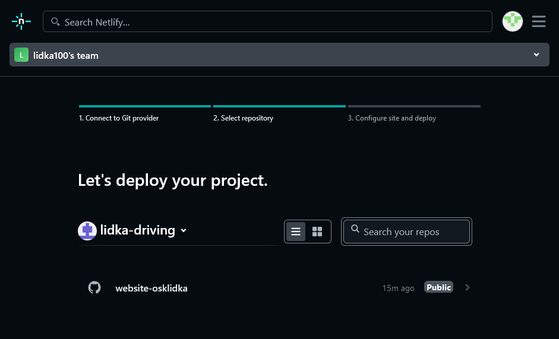
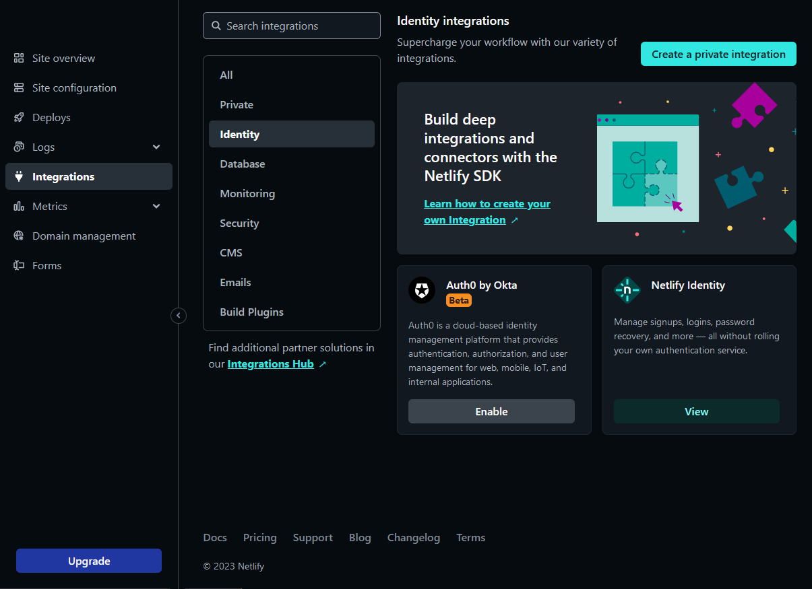

# Lidka's Driving School Business Website

(This README is availible in Polish only.)

Wykorzystane technologie: Jekyll, Decap CMS.

## Instalacja

Na przykładzie hostingu [Netlify](https://www.netlify.com/).

### Krok 1: Utwórz Fork Tego Repozytorium

Zalogujcie się na swoje konto w serwisie GitHub, użyjcie przycisku "Fork" na
górze tej strony i postępujcie zgodnie z instrukcjami na ekranie. Wystarczy
zrobić fork gałęzi _master_.

### Krok 2: Nowa Strona Internetowa przez Netlify

Zalogujcie się w serwisie Netlify.

Otwórzcie stronę z zestawieniem hostowanych stron. Na przykład, jeżeli podczas
rejestracji wybraliście "_lidka100_" jako swoją nazwę użytkownika, to można na
tę stronę przejść bezpośrednio, przechodząc pod adres
<https://app.netlify.com/teams/lidka100/overview> . Kliknijcie przycisk "_Add new
site_" | "_Import an existing site_".

W następnym kroku wybierzcie "_Deploy with GitHub_".

W nowym oknie zostaniecie poproszeni o nadanie uprawnień
Netlify do wprowadzania zmian na koncie GitHub w twoim imieniu. Kliknij
_Authorize Netlify_.

Następnie, w kroku "_2. Select Repository_", wybierzcie repozytorium,
które utworzyliście w kroku "_1. Utwórz Fork Tego Repozytorium_" tej
instrukcji.

### Krok 3: Włączenie Usługi Netlify Identity

Otwórzcie stronę z ustawieniami usługi _Netlify Identity_. Jeżeli Netlify
przydzieliło wam domenę "_guileless-heliotrope-80ea93_", to stronę można
znaleźć pod adresem:

<https://app.netlify.com/sites/guileless-heliotrope-80ea93/configuration/identity#git-gateway>

Będąc już na stronie, kliknijcie przycisk "_Enable Identity_".

### Krok 4: Włączenie Usługi Git Gateway

Na stronie "Site Configuration" przejdźcie do sekcji "Identity | Services"
i kilknijcie przycisk "Enable Git Gateway".

Jeżeli Netlify przydzieliło wam subdomenę "_guileless-heliotrope-80ea93_"
to możecie się tam udać bezpośrednio, przechodząc pod adres:

<https://app.netlify.com/sites/guileless-heliotrope-80ea93/configuration/identity#services>

### Krok 5: Utworzenie Konta Użytkownika w Netlify Identity

Otwórzcie stronę pod adresem:

<https://guileless-heliotrope-80ea93.netlify.app/admin/>

Ale najpierw zastąpcie _guileless-heliotrope-80ea93_ nazwą domeny, którą
przydzielił wam Netlify. Załóżcie nowe konto i potwierdźcie, że podany w
rejestracji adres e-mail należy do was, klikając w link, który zostanie wam
wysłany po wysłaniu formularza do rejestracji nowego konta.

**Uwaga**: Średnik na końcu adresu jest konieczny!

### Krok 6: Zarządzanie Kontami w Netlify Identity

Żeby zobaczyć, edytować, lub usuwać konta użytkowników strony, musicie przejść
pod specjalny adres:

<https://app.netlify.com/sites/guileless-heliotrope-80ea93/integrations/identity/netlify>

(Oczywiście, zmieniając w powyższym adresie "_guileless-heliotrope-80ea93_" na
nazwę waszej domeny.)

## Panel Administratora

Żeby otworzyć panel administratora, otwórzcie zasób pod ścieżką `/admin/`, np.:
<https://guileless-heliotrope-80ea93.netlify.app/admin/>.

Ukośnik na końcu jest **obowiązkowy**, inaczej Decap CMS zgłosi taki błąd:

> Error: Failed to load config.yml (404)

Więcej o tym problemie można przeczytać
[tutaj](https://github.com/decaporg/decap-cms/issues/332).
